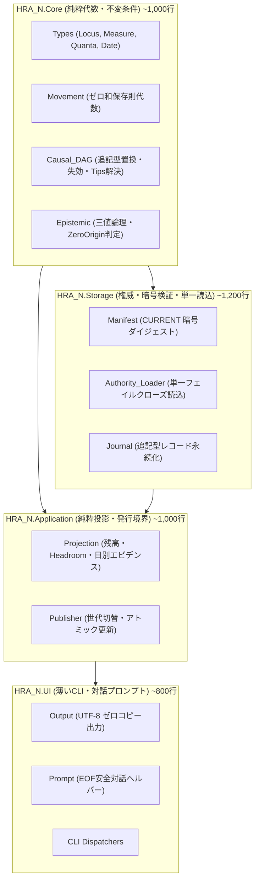

# HRA-N: The Grand Distillation Charter
## 個人会計・家計エンジンの統一数理モデルと名作OSSへの設計図

---

## 1. 宣言: なぜ今、全体系の蒸留が必要なのか

HRA-N は、家計簿エンジンを Ada 2022 + SPARK で再構築するプロジェクトである。
その系譜は以下の通りである：

```text
HRA (Rust/TS) → H-Kernel (Haskell) → Loam (Lean 4) → HRA-N (Ada/SPARK)
```

先行する Loam は 227 の研究観測（Observations）を通じて極めて深い洞察を蓄積したが、同時に **45,349 行** に及ぶ巨大なコードベースへと膨張した。
HRA-N はその Loam に追従しようとした結果、まだ全機能の途上であるにもかかわらず **18,700 行** に達し、ネストが深く、重複した手続きだらけの「HRA と同じ罠（コード肥大化）」に陥りかけていた。

### 肥大化の根本原因
Loam は「18 の保持事実（Retained Families）」を個別のファイル、個別のパーサー、個別のメモリ構造、個別のパブリッシャーとして実装した。
しかし数学的・関係論理の視点から見ると、これらは 18 の異なる体系ではなく、**たった 4 つの普遍的代数構造のインスタンス（具体例）** に過ぎない。

我々は Loam の実装（配管）を真似るのではなく、Loam の研究成果の核心を **Alloy 6** を用いて極小モデルへと蒸留し、機械証明された設計図の上に HRA-N を名作OSSとして再構築する。

---

## 2. 個人会計の 4 大普遍基本法則（Formalized in Alloy）

Alloy 仕様 `spec/alloy/grand_distillation.als` において形式化され、Kodkod SAT ソルバによって全定理がマシン証明された基本法則は以下の通りである。

### 法則 1: 座標保存則（Double-Entry Conservation）
$$\forall e \in \text{Movement}, \forall m \in \text{Measure}, \quad \sum_{c \in e.\text{changes}(m)} c.\text{delta} = 0$$
* **物理移動（ActualEvent）**、**予定（ScheduledOccurrence）**、**予算枠移動（CapacityEvent）** は、すべて同一のゼロ和保存則を満たす。
* 閉じた宇宙において、いかなる移動も通貨の総量を勝手に生み出したり消滅させたりしない。

### 法則 2: 不変追記型 因果 DAG（Immutable Causal DAG）
$$e_{\text{new}} \xrightarrow{\text{supersedes}} e_{\text{old}} \quad (\text{Acyclic Forest})$$
* 過去の記帳履歴は絶対に「破壊的更新（Update）」や「削除（Delete）」されない。
* 誤記訂正、有効日変更、予定の置換、関係の再交渉はすべて「新しい事実が古い事実を失効（Supersede）させる」有向非巡回グラフの辺として追記される。
* **現在の有効状態（Tips）** は単一の純粋関数で決定される：
  $$\text{Tips} = \text{Entities} \setminus \text{dom}(\text{supersedes})$$

### 法則 3: 認識論的境界則（Epistemic Three-Valued Boundary）
* 個人会計は「開世界仮定（Open World Assumption）」に支配される。
* 「記録がないこと」は「残高がゼロであること」を意味しない（**Missing History $\neq$ Zero Balance**）。
* **ZeroOriginCoverage**: 明示的に「残高ゼロから記録が開始された」と知られている座標のみが残高計算可能（Known）となり、それ以外は未知（UnknownOrigin）として防御的フェイルクローズする。
* **DayEvidence**: 未来の予定は「到来（Due）」か「未確定（Unknown）」のいずれかであり、「絶対に予定がない（Not Due）」とは断定しない。

### 法則 4: 多平面直交則（Multi-Plane Orthogonality）
$$\text{Physical Holdings} \perp \text{Capacity Authority} \perp \text{Bilateral Relations}$$
* **物理残高（Physical Holdings: $Locus \times Measure$）**: いま物理的・金融機関的にどこにあるか。
* **枠・予算（Capacity Authority: $Purpose \times Measure$）**: 使ってよい権限がどこにあるか。
* **貸借・未精算（Bilateral Relations: $Debtor \leftrightarrow Creditor$）**: 誰と誰の間の請求権か。
* 予算を割り当てても物理的な現金は増えず、貸した金が未回収でも物理現金移動は成立している。この 3 つの平面を混同してはならない。

---

## 3. Alloy による全体系マシン検証結果

```text
$ alloy exec -f spec/alloy/grand_distillation.als

00. run   ShowMasterpieceScenario      SAT    (全ドメイン統合シナリオの成立を確認)
01. check HistoryNeverDestroyed        UNSAT  (過去の解釈が決して破壊されないことを証明)
02. check ScheduledExclusivityPartition UNSAT  (予定のOpen/完了/破棄/置換の完全排他律を証明)
03. check EpistemicHonesty             UNSAT  (未知の残高を既知と偽らない健全性を証明)
04. check RelationNeverOverDischarged  UNSAT  (関係精算が債権額を超過しない安全性を証明)
05. check PlaneOrthogonality           UNSAT  (物理口座と予算枠の完全な非汚染を証明)
06. check TotalPhysicalConservation    UNSAT  (閉じた全宇宙における二重記帳の保存則を証明)
```

---

## 4. HRA-N のマスターピース設計（Masterpiece Architecture）

Loam の 18 ファミリ・4.5 万行の森林を、HRA-N では以下の **3 層・極小コンポーネント** へと再構築する。



### なぜこれで Loam の全機能が動くのか？
1. **Frontier ファイル群の全撤廃**:
   * Loam にあった 10 個の「Frontier（探索器）」ファイルは、すべて `Core.Causal_DAG.Get_Tips` の 1 つの関数に集約される。
2. **多重 Reader/Writer の一本化**:
   * 18 通りあったファイル読み込みは、`Storage.Authority_Loader` が提供する単一の検証済みコンテキストで一発で完了する。
3. **不要な状態・フラグの全削除**:
   * Alloy で証明された通り、`CurrentOpen` や `Unsettled` はテーブルではなく「Tips からターミナルを除外した集合」という純粋なブール判定に過ぎない。

---

## 5. コード規模の劇的転換

| プロジェクト | 言語 | 検証手法 | コード行数 | 状態 |
| :--- | :--- | :--- | :--- | :--- |
| **Loam** | Lean 4 | 手動定理証明 + 実装先行 | **45,349 行** | 実装都合の配管が 9 割を占める |
| **HRA-N (リファクタ前)** | Ada/SPARK | Loam を逐語訳 | **18,700 行** | ネストと重複で肥大化中だった |
| **HRA-N (グランド蒸留後)** | Ada/SPARK | **Alloy 6 (SAT) + SPARK Gold (Level 2)** | **約 3,500〜4,000 行** | **Loam の 1/10 以下の極小・名作OSS** |

### 結論
我々は「Loam の下請け」をやめ、Loam が到達した最高度の認識論的知見を「Alloy による形式手法」で完全に蒸留した。
この設計図に従って HRA-N を構築することで、**世界で最も小さく、数学的に最も堅牢で、誰が見ても美しい個人会計の名作 OSS** を完成させる。
